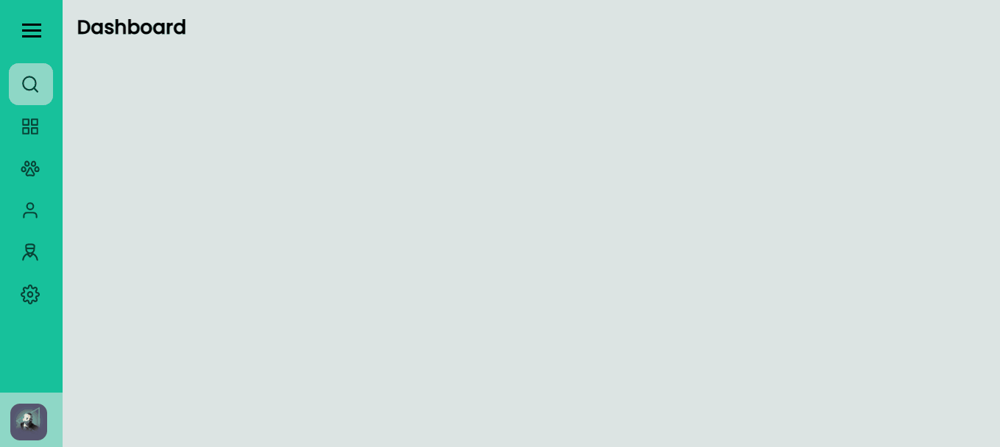

# Sidebar

Sidebar desenvolvida de acordo com algumas das especificações dadas no desafio "Sidebar" da Rocketseat. Ao clicar no menu hambúrguer ele mostrará os links, e apresentará um "X" que ao ser clicado irá fechar a sidebar.

### 👨‍💻 Tecnologias

- HTML
- CSS
- JavaScript

### 😀 Autor

Feito por Jonathan Amarante 👋🏽 Entre em contato!

